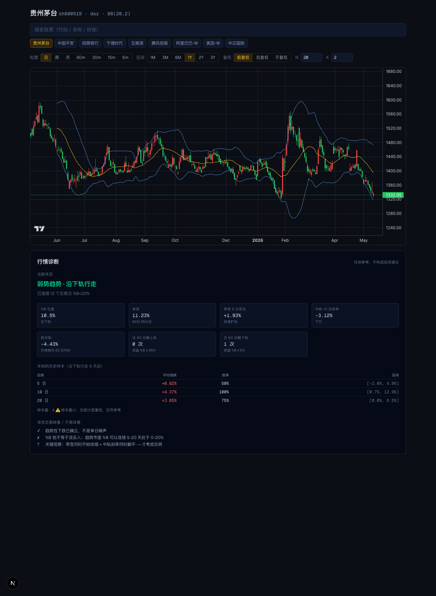

# 布林带 · A股 / 港股看板

为个人看盘自建的布林带（Bollinger Bands）行情工具。覆盖 **A 股 + 港股**，参数可调（周期 N / 倍数 K / 时间区间 / K 线粒度），并在图表下方提供一个**只描述状态、不给出买卖建议**的诊断面板。



## 项目特点

- **零依赖 / 零数据库** — 上游数据走腾讯财经公开接口（不需要 key、不需要付费），单次响应 130–240ms
- **客户端计算指标** — 改 N / K 不重新拉数据，瞬时重绘
- **状态而非建议** — 诊断面板识别 8 类布林带状态（沿上轨/沿下轨/收口/扩张顶端/上行/下行/区间/混合），并基于**本标的历史样本**给出未来 5/10/20 日的统计区间和胜率，避免单一指标当作交易信号
- **URL 即状态** — 所有参数挂在 query string，刷新 / 分享链接保留资产、参数和粒度

## 技术栈

| 维度 | 选用 |
|---|---|
| 框架 | Next.js 14+ (App Router) + TypeScript |
| 样式 | Tailwind CSS |
| 图表 | TradingView `lightweight-charts` v5 |
| 数据 | SWR + Next.js Route Handlers |
| 测试 | Vitest（33 个单测，覆盖核心纯函数） |
| 包管理 | pnpm |

## 数据源

| 用途 | 接口 | 说明 |
|---|---|---|
| K 线（主） | 腾讯财经 `web.ifzq.gtimg.cn` | A 股 + 港股 + 日/周/月/5-60m |
| K 线（备） | 东方财富 `push2his.eastmoney.com` | A 股 fallback（港股不支持） |
| 资产搜索 | 东方财富 `searchadapter.eastmoney.com` | 名称 / 拼音 / 代码 |

详见 [DESIGN.md §4](./DESIGN.md#4-数据源调研与选型)。

## 关键非显然约束

- 腾讯日 K **单次最多 ~800 根**（≈ 3 年），`from/to` 参数对回溯历史**无效**。UI 把日 K 区间上限设到 3Y，更长历史请切到周 / 月 K
- 腾讯返回的行格式是 `[date, open, close, high, low, volume]` — **close 在位置 2，先于 high/low**
- A 股响应键是 `qfqday` / `qfqweek`，港股是 `day` / `week`（**无 qfq 前缀**），datasource 层统一归一化
- 布林带 stddev 用**样本标准差**（除以 N-1），与 TradingView Pine Script `stdev` 一致

## 缓存策略（不引入存储层）

`Cache-Control: s-maxage=N` 按交易时段动态调整：

| 场景 | TTL |
|---|---|
| 最新 K 是今天 + 盘中 | 60s |
| 最新 K 是今天 + 盘后 | 3600s |
| 最新 K 是历史日 / 非交易日 | 21600s（6h） |

加上浏览器 SWR `dedupingInterval: 30s`，一个个人会话实际打上游的次数约 3–8 次 / 30 分钟。详见 [DESIGN.md §5](./DESIGN.md#5-数据存储决策)。

## 开发

```bash
pnpm install
pnpm dev          # http://localhost:3000

pnpm test         # 运行单测（33 个）
pnpm lint
pnpm build
```

冒烟测试：

```bash
curl 'localhost:3000/api/kline?market=sh&code=600519&period=day&limit=5'
curl 'localhost:3000/api/kline?market=hk&code=00700&period=day&limit=5'
curl 'localhost:3000/api/search?q=茅台'
```

## 目录结构

```
app/
  page.tsx                 # 主页（client）
  api/kline/route.ts       # K 线代理
  api/search/route.ts      # 搜索代理
components/
  Chart.tsx                # lightweight-charts 封装
  AssetPicker.tsx          # 搜索 + 快捷资产
  Controls.tsx             # 粒度 / N / K / 区间 / 复权
  Diagnose.tsx             # 行情诊断面板（无买卖建议）
lib/
  datasource.ts            # 上游 → 归一化
  indicators.ts            # computeBollinger 纯函数
  diagnose.ts              # 状态识别 + 历史回测
  cache-policy.ts          # 动态 revalidate TTL
  url-state.ts             # URL ↔ ViewState
  symbols.ts               # 快捷资产列表
```

## 范围外

- 不持久化 K 线数据（详见 [DESIGN.md §5](./DESIGN.md#5-数据存储决策)）
- 不做用户系统 / 收藏夹（URL query 已能分享）
- 不做美股 / 加密 / 多指标组合
- 不做实时推送
- **不给出"买入 / 卖出 / 持有"等行动建议** — 这是有意的设计，详见 `components/Diagnose.tsx` 顶部注释

## 文档

- [DESIGN.md](./DESIGN.md) — 完整技术方案（15 章 + 附录）
- [CLAUDE.md](./CLAUDE.md) — 项目级 AI 协作约定 / 关键约束速查
